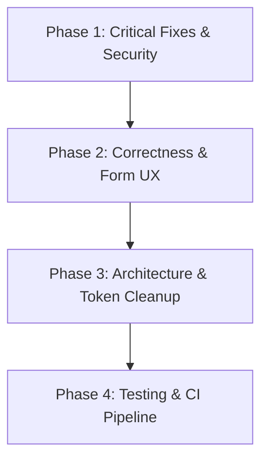

# Code Review: `main` vs `MAA-3` Branch

**Review Date:** 2026-09-14  
**Target Branch:** `main`  
**Feature Branch:** `MAA-3`  
**Scope:** Full diff across Frontend (`Src/MAASFrontend`), Backend (`Src/MAASBackend`), Tooling, and CI/CD (`.github/workflows`).

---

## Executive Summary

The `MAA-3` branch introduces substantial additions to the MAAS (Medical Appointment Assistant Solution) project, including the initial authentication pages (`LoginPage`, `RegisterPage`, `ForgotPasswordPage`, `ResetPasswordPage`), atomic UI components (`Button`, `Input`, `DatePicker`, `SegmentedControl`, `Checkbox`, `SocialLoginButton`), a directory reorganization from `Scr` to `Src`, and design token foundations.

While the UI foundation is well-crafted, this review identifies several critical bugs, security considerations, architectural inconsistencies, and CI/CD gaps that should be addressed before merging into `main`.

---

## 1. Correctness & Logic Bugs

### 1.1 Invalid CORS Origin Contract in ASP.NET Core (`Src/MAASBackend/Program.cs`)
* **Location:** [`Src/MAASBackend/Program.cs#L8-L14`](file:///Users/suleimanalshblak/Git/MAAS/Src/MAASBackend/Program.cs#L8-L14)
* **Finding:** The CORS policy configuration specifies:
  ```csharp
  policy.WithOrigins("http://localhost:5173/")
  ```
  Per RFC 6454 and the W3C Web Origin specification, an origin consists strictly of `scheme + host + port` without a trailing slash. Browsers send `Origin: http://localhost:5173`. Because ASP.NET Core evaluates origins using exact string matching, every request from the Vite development server will be rejected by the CORS middleware with a 403 Forbidden or missing `Access-Control-Allow-Origin` header.
* **Remediation:** Remove the trailing slash:
  ```csharp
  policy.WithOrigins("http://localhost:5173")
  ```

---

### 1.2 Hash-Based Router Drops Token and Query Parameters (`Src/MAASFrontend/src/App.tsx`)
* **Location:** [`Src/MAASFrontend/src/App.tsx#L10-L21`](file:///Users/suleimanalshblak/Git/MAAS/Src/MAASFrontend/src/App.tsx#L10-L21)
* **Finding:** `getPageFromHash` uses an exact switch statement on `window.location.hash`:
  ```tsx
  switch (window.location.hash) {
    case "#login": return "login";
    case "#forgot-password": return "forgot-password";
    case "#reset-password": return "reset-password";
    default: return "register";
  }
  ```
  Real-world password reset workflows send links such as `/#reset-password?token=XYZ` or `/#reset-password&email=...`. Exact matching fails on any hash with query params, trailing slashes, or tokens, causing the router to fall through to `register`.
* **Remediation:** Parse the base hash route using `window.location.hash.split("?")[0].replace(/\/$/, "")` or adopt a standard client-side router (e.g. React Router or TanStack Router).

---

### 1.3 Asymmetric Real-Time Password Error Clearing (`Src/MAASFrontend/src/pages/ResetPasswordPage/ResetPasswordPage.tsx`)
* **Location:** [`Src/MAASFrontend/src/pages/ResetPasswordPage/ResetPasswordPage.tsx#L47-L50`](file:///Users/suleimanalshblak/Git/MAAS/Src/MAASFrontend/src/pages/ResetPasswordPage/ResetPasswordPage.tsx#L47-L50)
* **Finding:** In `updateField`, the mismatch error is only cleared when updating `password`:
  ```tsx
  setErrors((current) => ({
    ...current,
    [name]: undefined,
    ...(name === "password" && value === formData.confirmPassword ? { confirmPassword: undefined } : {})
  }));
  ```
  If a user has a "Passwords do not match" error on `confirmPassword` and then corrects their typing in the `confirmPassword` field, the error is NOT cleared until form submission. Contrast with `RegisterPage.tsx#L148-L157`, which correctly checks both fields.
* **Remediation:** Mirror the bidirectional check so updating either field clears the mismatch error when values match.

---

### 1.4 DatePicker Future Date Validation Flaw (`Src/MAASFrontend/src/components/common/DatePicker/DatePicker.tsx` & `RegisterPage.tsx`)
* **Location:** [`Src/MAASFrontend/src/components/common/DatePicker/DatePicker.tsx#L120`](file:///Users/suleimanalshblak/Git/MAAS/Src/MAASFrontend/src/components/common/DatePicker/DatePicker.tsx#L120), [`RegisterPage.tsx#L97`](file:///Users/suleimanalshblak/Git/MAAS/Src/MAASFrontend/src/pages/RegisterPage/RegisterPage.tsx#L97)
* **Finding:** Date comparison only checks `getFullYear() > today.getFullYear()`:
  ```tsx
  const isBeyondMaxYear = date.getFullYear() > today.getFullYear();
  ```
  A date later in the *current* calendar year (e.g., next month or tomorrow) is neither disabled on the calendar nor flagged as invalid during registration. A birth date cannot be in the future.
* **Remediation:** Compare the complete date timestamp (`date > today`) rather than only the year.

---

### 1.5 Missing State-to-UI Contract for `rememberMe` (`Src/MAASFrontend/src/pages/LoginPage/LoginPage.tsx`)
* **Location:** [`Src/MAASFrontend/src/pages/LoginPage/LoginPage.tsx#L17-L38`](file:///Users/suleimanalshblak/Git/MAAS/Src/MAASFrontend/src/pages/LoginPage/LoginPage.tsx#L17-L38)
* **Finding:** `formData` declares `rememberMe: boolean`, which is cleared and managed in state, but no Checkbox is rendered anywhere in `LoginPage.tsx`.
* **Remediation:** Render the `<Checkbox label="Remember me" name="rememberMe" checked={formData.rememberMe} onChange={handleInputChange} />` component or remove `rememberMe` from state.

---

### 1.6 Branding Copy Discrepancy (`Src/MAASFrontend/src/pages/RegisterPage/RegisterPage.tsx`)
* **Location:** [`Src/MAASFrontend/src/pages/RegisterPage/RegisterPage.tsx#L213-L219`](file:///Users/suleimanalshblak/Git/MAAS/Src/MAASFrontend/src/pages/RegisterPage/RegisterPage.tsx#L213-L219)
* **Finding:** Copy states:
  > *"Connect to SanoPath secure healthcare network."*  
  > *"Account created successfully! Welcome to SanoPath."*  
  The application is named **MAAS** (Medical Appointment Assistant Solution).
* **Remediation:** Replace "SanoPath" with the project name "MAAS".

---

### 1.7 Organization Name Validation for Practice Role (`Src/MAASFrontend/src/pages/RegisterPage/RegisterPage.tsx`)
* **Location:** [`Src/MAASFrontend/src/pages/RegisterPage/RegisterPage.tsx#L80-L130`](file:///Users/suleimanalshblak/Git/MAAS/Src/MAASFrontend/src/pages/RegisterPage/RegisterPage.tsx#L80-L130)
* **Finding:** When a user selects the `"practice"` role in `SegmentedControl`, `organizationName` remains optional and unvalidated. A healthcare organization can register without a practice name.
* **Remediation:** Require `organizationName` when `formData.role === "practice"`, and conditionally display or adapt the label accordingly.

---

## 2. Security Findings

### 2.1 Known High Severity Vulnerability in .NET Backend Dependency (GHSA-v5pm-xwqc-g5wc)
* **Severity:** High
* **Location:** [`Src/MAASBackend/MAASBackend.csproj#L10`](file:///Users/suleimanalshblak/Git/MAAS/Src/MAASBackend/MAASBackend.csproj#L10)
* **Finding:** Building `MAASBackend.csproj` emits `warning NU1903: Package 'Microsoft.OpenApi' 2.0.0 has a known high severity vulnerability, https://github.com/advisories/GHSA-v5pm-xwqc-g5wc`. This advisory covers a denial-of-service and memory exhaustion vector when parsing OpenAPI schemas.
* **Remediation:** Update `Microsoft.AspNetCore.OpenApi` or explicitly add package reference `<PackageReference Include="Microsoft.OpenApi" Version="2.0.2" />` (or the latest patched version) to override the vulnerable transitive dependency.

---

### 2.2 Healthcare Password Policy Inconsistencies & Complexity Deficiency
* **Severity:** Medium
* **Location:** [`LoginPage.tsx#L69`](file:///Users/suleimanalshblak/Git/MAAS/Src/MAASFrontend/src/pages/LoginPage/LoginPage.tsx#L69), [`RegisterPage.tsx#L118`](file:///Users/suleimanalshblak/Git/MAAS/Src/MAASFrontend/src/pages/RegisterPage/RegisterPage.tsx#L118), [`ResetPasswordPage.tsx#L30`](file:///Users/suleimanalshblak/Git/MAAS/Src/MAASFrontend/src/pages/ResetPasswordPage/ResetPasswordPage.tsx#L30)
* **Finding:**
  1. `LoginPage` permits passwords of length 6 (`password.length < 6`), while registration and password reset enforce length 8 (`password.length < 8`).
  2. No password complexity is enforced (e.g., requiring numbers, mixed-case, or special characters). For a healthcare platform managing medical appointments and prescriptions (HIPAA / GDPR relevance), repeated single-character passwords (e.g. `aaaaaaaa`) should not be permitted.
* **Remediation:** Standardize minimum password length to 8 across all auth pages and implement basic complexity checks (e.g. at least one number and one letter).

---

### 2.3 Unauthenticated / Stateless Reset Password Token Handling
* **Severity:** Medium
* **Location:** [`Src/MAASFrontend/src/pages/ResetPasswordPage/ResetPasswordPage.tsx#L39`](file:///Users/suleimanalshblak/Git/MAAS/Src/MAASFrontend/src/pages/ResetPasswordPage/ResetPasswordPage.tsx#L39)
* **Finding:** `ResetPasswordPage` allows password submission without reading, holding, or verifying a reset token from the URL query or hash. Anyone accessing the route could trigger mock submission without demonstrating ownership of the reset request.
* **Remediation:** Read token from URL query (`?token=...`), validate presence before allowing submission, and display an invalid/expired link warning if absent.

---

## 3. Architecture & Code Quality

### 3.1 Redundant / Accidental Root `package.json` and `package-lock.json`
* **Location:** [`package.json`](file:///Users/suleimanalshblak/Git/MAAS/package.json), [`package-lock.json`](file:///Users/suleimanalshblak/Git/MAAS/package-lock.json)
* **Finding:** A `package.json` exists at the project root with 3 dependencies (`@material-tailwind/react`, `@lineiconshq/free-icons`, `@lineiconshq/react-lineicons`), which duplicate the dependencies already declared in `Src/MAASFrontend/package.json`. This was caused by running `npm install` from the repository root rather than inside `Src/MAASFrontend`.
* **Remediation:** Remove `package.json`, `package-lock.json`, and `node_modules` from the workspace root to eliminate confusion and maintain clean project boundaries.

---

### 3.2 Tailwind CSS v4 vs. Legacy `tailwind.config.js` Drift
* **Location:** [`Src/MAASFrontend/tailwind.config.js`](file:///Users/suleimanalshblak/Git/MAAS/Src/MAASFrontend/tailwind.config.js), [`Src/MAASFrontend/src/index.css#L3-L7`](file:///Users/suleimanalshblak/Git/MAAS/Src/MAASFrontend/src/index.css#L3-L7)
* **Finding:**
  1. The project uses Tailwind CSS v4 (`@tailwindcss/vite` 4.3.3) with `@import "tailwindcss"` and `@theme` in `src/index.css`. Tailwind v4 does not load `tailwind.config.js` by default unless configured via `@config`.
  2. The two files declare conflicting color palettes: `tailwind.config.js` defines `primary-500: '#3b82f6'` (standard blue), while `src/index.css` defines `--color-primary-500: #078bc5` (cyan/teal).
  3. `Src/MAASFrontend/src/tokens/design-tokens.ts` also still defines `primary[500]: '#3b82f6'`, conflicting with the actual UI styling.
* **Remediation:** Consolidate tokens: update `design-tokens.ts` with `#078bc5`, delete the unreferenced `tailwind.config.js` or connect it via `@config`, and declare theme variables consistently in `src/index.css`.

---

### 3.3 Hardcoded Hex Values Bypassing Design Tokens
* **Location:** `LoginPage.css`, `RegisterPage.css`, `DatePicker.css`, `SegmentedControl.tsx`
* **Finding:** Colors `#078bc5`, `#087eb3`, `#d94b55`, `#5d6878`, and `#f0f4f8` are hardcoded directly in CSS rules and inline class names rather than using Tailwind theme utility classes or CSS variables (e.g. `bg-primary-500`, `text-neutral-600`).
* **Remediation:** Replace hardcoded hex codes with semantic utility classes (`bg-primary-500`, `hover:bg-primary-600`, `text-neutral-500`).

---

### 3.4 React 19 / SSR Anti-Pattern in `Checkbox.tsx`
* **Location:** [`Src/MAASFrontend/src/components/common/Checkbox/Checkbox.tsx#L15`](file:///Users/suleimanalshblak/Git/MAAS/Src/MAASFrontend/src/components/common/Checkbox/Checkbox.tsx#L15)
* **Finding:** `const checkboxId = id || 'checkbox-${Math.random().toString(36).slice(2)}';` creates an impure render, generates a new ID on every re-render, and produces SSR hydration mismatch.
* **Remediation:** Use React 19's `useId()` hook (consistent with `Input.tsx` and `DatePicker.tsx`).

---

### 3.5 Dead Code and Unused Assets
* **Location:**
  - `Src/MAASFrontend/src/components/common/SocialLoginButton/SocialLoginButton.tsx` (unused; uses emojis for logos)
  - `Src/MAASFrontend/src/components/common/Button/Button.module.css` (0 bytes, empty)
  - `Src/MAASFrontend/src/components/layout/placeholder.md` (0 bytes, empty)
* **Remediation:** Remove empty files. If social login is not on the immediate roadmap, remove or move `SocialLoginButton` to a feature branch.

---

### 3.6 Vite Missing Development API Proxy
* **Location:** [`Src/MAASFrontend/vite.config.ts`](file:///Users/suleimanalshblak/Git/MAAS/Src/MAASFrontend/vite.config.ts)
* **Finding:** `vite.config.ts` does not define `server.proxy` to forward `/api` requests to ASP.NET Core (`http://localhost:5068`), requiring frontend code to manage hardcoded backend endpoints once connected.
* **Remediation:** Configure `server.proxy: { '/api': { target: 'http://localhost:5068', changeOrigin: true } }`.

---

## 4. Testing & CI/CD Findings

### 4.1 Broken Frontend CI Step (`.github/workflows/build.yml`)
* **Location:** [`.github/workflows/build.yml#L48-L51`](file:///Users/suleimanalshblak/Git/MAAS/.github/workflows/build.yml#L48-L51)
* **Finding:**
  ```yaml
  - name: Run Linting / Tests (Optional)
    run: npm test -- --watchAll=false
    working-directory: ./Src/MAASFrontend
    continue-on-error: true
  ```
  1. `Src/MAASFrontend/package.json` has **no `test` script**. Every run fails with `npm error Missing script: "test"`.
  2. The `--watchAll=false` parameter is a legacy Jest argument incompatible with Vite / Vitest.
  3. The workflow does not invoke `npm run lint` (`oxlint`), bypassing the linter in CI.
* **Remediation:**
  Update the step to run `npm run lint`, add a test runner (Vitest), and configure an `npm test` script in `package.json`.

---

### 4.2 Complete Absence of Automated Test Suites
* **Location:** `Tests/`, `Src/MAASFrontend/src/components/common/Button/Button.test.tsx`
* **Finding:**
  1. `Button.test.tsx` is an empty 0-byte file.
  2. No testing dependencies (`vitest`, `@testing-library/react`, `@testing-library/jest-dom`) are installed in `Src/MAASFrontend`.
  3. `Tests/` at the repository root contains only an empty `README.md`. No .NET test project (`xUnit` / `NUnit`) exists for `MAASBackend`.
* **Remediation:**
  1. Install Vitest and React Testing Library in `Src/MAASFrontend`.
  2. Add unit tests for `Button`, `Input` (floating label states), `DatePicker` (date parsing, month boundaries), and page validators.
  3. Add a .NET test project under `Tests/MAASBackend.Tests` to test backend CORS policies and future endpoints.

---

## Step-by-Step Remediation Plan



### Phase 1: Critical Fixes & Security (High Priority)
1. **Fix ASP.NET Core CORS Origin:**
   - In `Src/MAASBackend/Program.cs`, change `"http://localhost:5173/"` to `"http://localhost:5173"`.
2. **Patch Backend NuGet Vulnerability:**
   - In `Src/MAASBackend/MAASBackend.csproj`, update OpenAPI package or pin `Microsoft.OpenApi` to patched version `>= 2.0.2` to resolve GHSA-v5pm-xwqc-g5wc.
3. **Fix CI Workflow Script:**
   - In `.github/workflows/build.yml`, replace `npm test -- --watchAll=false` with `npm run lint`.
4. **Fix Hash Router Parameter Stripping:**
   - In `Src/MAASFrontend/src/App.tsx`, parse `window.location.hash.split("?")[0]` so routes with query parameters (`#reset-password?token=...`) resolve correctly.

### Phase 2: Correctness & Form UX (Medium Priority)
1. **Fix ResetPasswordPage Error Clearing:**
   - In `Src/MAASFrontend/src/pages/ResetPasswordPage/ResetPasswordPage.tsx`, ensure `updateField` checks both `password` and `confirmPassword` to clear mismatch errors in real time.
2. **Fix DatePicker Future Date Validation:**
   - In `Src/MAASFrontend/src/components/common/DatePicker/DatePicker.tsx` and `RegisterPage.tsx`, compare full date objects (`date > today`) rather than only `getFullYear()`.
3. **Fix Checkbox `useId` Anti-Pattern:**
   - In `Src/MAASFrontend/src/components/common/Checkbox/Checkbox.tsx`, replace `Math.random()` with React 19's `useId()`.
4. **Connect `rememberMe` in LoginPage:**
   - Add `<Checkbox label="Remember me" name="rememberMe" checked={formData.rememberMe} onChange={handleInputChange} />` to `LoginPage.tsx`.
5. **Fix Branding Copy:**
   - Replace "SanoPath" with "MAAS" in `RegisterPage.tsx`.
6. **Enforce Organization Name for Practice Role:**
   - Make `organizationName` required when `role === "practice"` in `RegisterPage.tsx`.

### Phase 3: Architecture & Token Cleanup (Medium Priority)
1. **Remove Accidental Root Package Files:**
   - Delete root `package.json` and root `package-lock.json`.
2. **Consolidate Design Tokens & Tailwind Configuration:**
   - Remove obsolete `Src/MAASFrontend/tailwind.config.js`.
   - Update `Src/MAASFrontend/src/tokens/design-tokens.ts` to use `#078bc5` for `primary[500]`.
   - Replace hardcoded hex colors in CSS files with semantic Tailwind utility classes (`bg-primary-500`, `text-primary-600`, etc.).
3. **Remove Empty Dead Files:**
   - Remove `Src/MAASFrontend/src/components/common/Button/Button.module.css` and `Src/MAASFrontend/src/components/layout/placeholder.md`.
4. **Configure Vite API Proxy:**
   - In `Src/MAASFrontend/vite.config.ts`, add `server.proxy` for `/api`.

### Phase 4: Testing & CI Pipeline (Medium-Low Priority)
1. **Install Frontend Test Stack:**
   - Install `vitest`, `@testing-library/react`, and `jsdom` in `Src/MAASFrontend`.
   - Add `"test": "vitest run"` to `package.json`.
2. **Implement Core Unit Tests:**
   - `Button.test.tsx`: Render variants, loading state, click handlers.
   - `Input.test.tsx`: Floating label transitions, error rendering, icon rendering.
   - `DatePicker.test.tsx`: Date selection, calendar boundary restrictions.
3. **Initialize Backend Test Project:**
   - Create `Tests/MAASBackend.Tests/MAASBackend.Tests.csproj` with xUnit.
   - Add integration test checking CORS headers and OpenAPI schema endpoint.
4. **Finalize CI Workflow:**
   - Ensure GitHub Actions runs `npm run lint` and `npm test` without `continue-on-error: true`.
